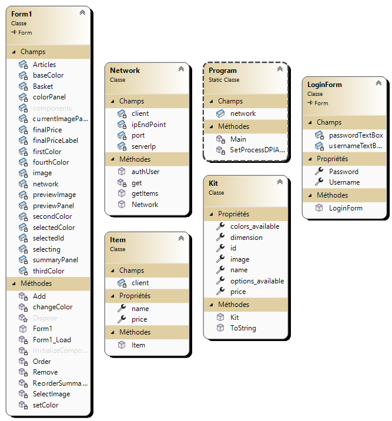
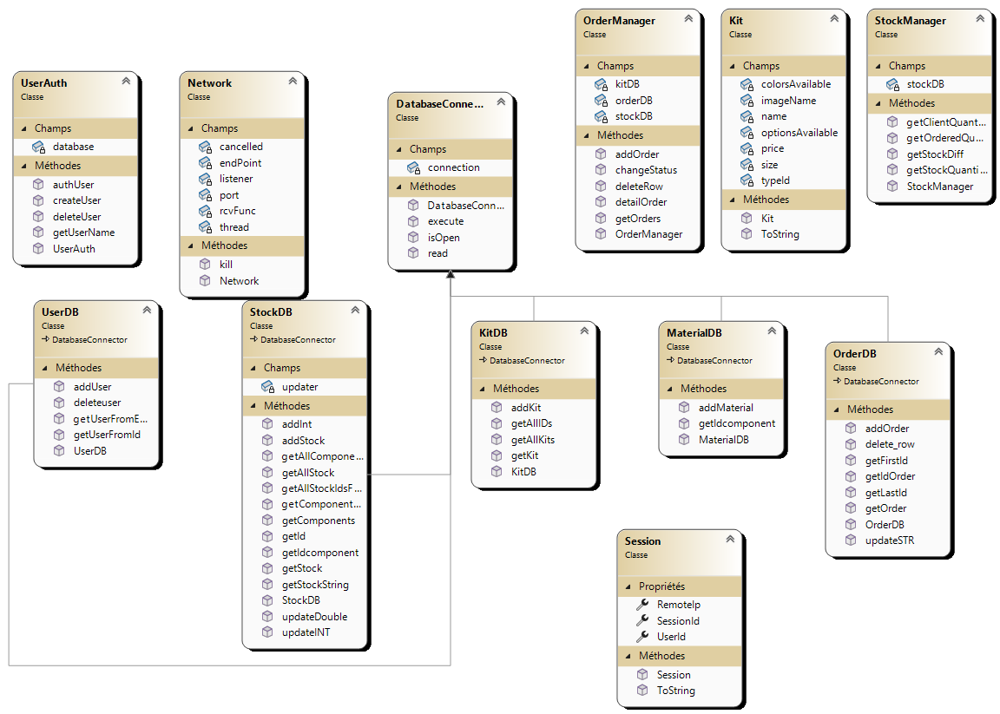
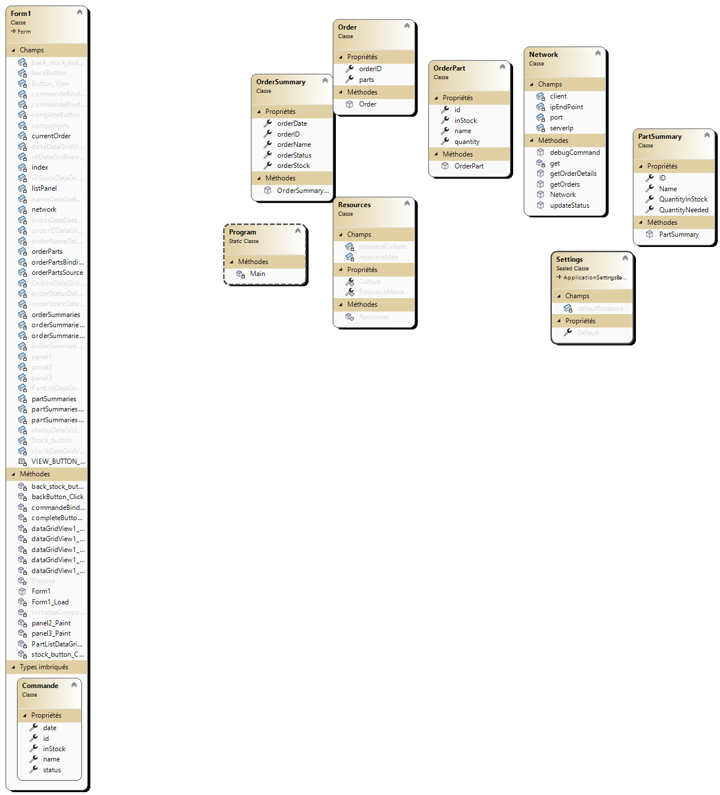
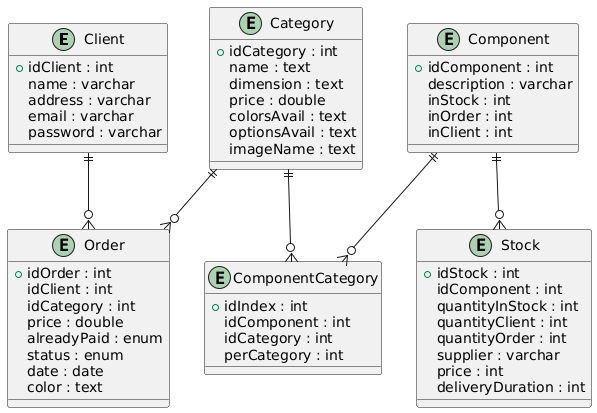

# Angleiron

## Introduction

**Angleiron** is a modular software solution composed of multiple independent yet complementary projects. It is designed to manage interactions between a client application, a server, database management tools, and merchant-related processes.

The main goal of this solution is to maintain a clean, scalable, and maintainable architecture.

---

## Diagram
### Class Diagram
#### ClientAPP

#### Server 

#### Marchand APP

### Relationship entity diagram

---

## Server

The `serverapp` project contains the main backend API. It exposes REST (or gRPC, if applicable) endpoints to handle data exchange between clients and the database.

**Main features:**
- Authentication & Security
- User and Role Management
- Request Handling
- Database Communication

The protocol for proper use of the server can be found [here](doc/protocol.md).

---
## Managing Database

The `merchandapp` project manages the merchant side of the database. It handles creation, updates, and deletion of records related to products, transactions, or partners.

It may also include:
- Initialization scripts for the database
- Tools for migrations or data integrity checks
- Internal administration utilities

---

## Client App

Two versions of the client are available on the github:

- `clientapp`: the oldest version coded with dotnet 4.8, which serves as a stable base for the application. Unfortunately, this version was not designed with modern UI/UX principles in mind, and it may not be suitable for new development.
- `ClientAppRemake`: an alternative or redesigned version experimenting with new UI/UX concepts.

Both clients consume services from the `serverapp` and provide user interfaces to interact with the system.

---

## Merchant App

The `merchandapp` project is responsible for the front-end of the marchand application. It provides a user interface for merchants to manage pending orders, view transactions, and interact with customers.

First page : This is a summary of all pending orders
 You can view the order details by clicking the "view" button in the last column. You can also interact with the stock button to see all the different parts in stock.

 Order Details : When you click on the view button, you will see the details of a specific order, with all the parts that compound it, how many do you need and if they're in stock. You can mark it as completed by clicking the "Complete" button or go back on the order summary by clicking the "Back" button
 Stock Details : When you click on the "Stock" button, you access the stock details where you can see all the different parts in stock, how many parts you need to complete the orders and how many you ordered. By clicking the "Buy" button, you will command all the missing parts to complete the orders. When the different suppliers deliverd the ordered parts, you can add them to the stock by indicating the number and the ID of the parts and clcik on the "Stock Recieved" button.

> 📌 **Note**: For contributions, issues, or suggestions, feel free to open a ticket or a pull request in the corresponding repository.
